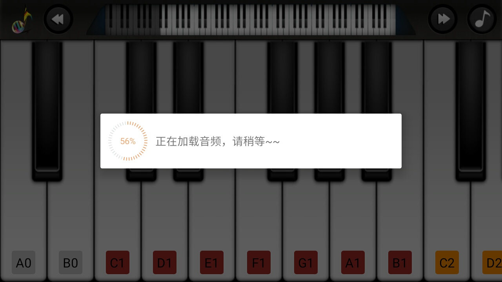

# BeautifulLED
基于Ardunio的灯带的嵌入式开发，目前的规模是一个主机、7个从机和安卓APP组成。Arduino模块之间通过IIC进行通讯，主机负责接收APP发送的指令，然后通知从机发射彩色灯段，安卓端和从机之间通过UDP协议通讯，主机使用ESP8366WIFI模块，并创建远端可变UDP连接。

### 目录结构：
 - [BeautifulLED](./BeautifulLED) （Arduino控制的灯带的程序）
 - [ESP8266WIFI](./ESP8266WIFI)（WIFI模块程序）
 - [App/BeautifulLED](./App/BeautifulLED)（安卓APP程序[测试版]）

### 指令:
指令格式 ： BL + 指令类型 + : + 指令信息 + #

	BL -- Beautiful LED的缩写
	指令类型 -- 为数字，代表不同的指令
	: -- 提示指令信息开始
	指令信息 -- 指令的具体内容（如WIFI名称）
	# --结束提示符

- CDC0:WIFI名字# -- 设置WIFI名字
- CDC1:WIFI密码# -- 设置WIFI密码
- CDC2:ip地址# -- 设置WIFI模块固定IP
- CDC3:路由器子网掩码# -- 设置路由器子网掩码
- CDC4:路由器网关# -- 设置路由器网关
- CDC5:# -- 配置网络（连接WIFI、设置ip、设置子网掩码和网关）
- CDC6:灯带的IIC地址# -- 指定特定地址的灯带发射灯段

### 效果图:
- 嵌入式：

- 安卓：

 

